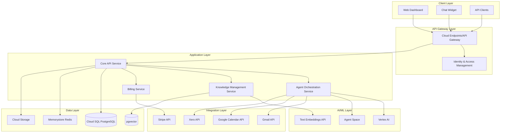
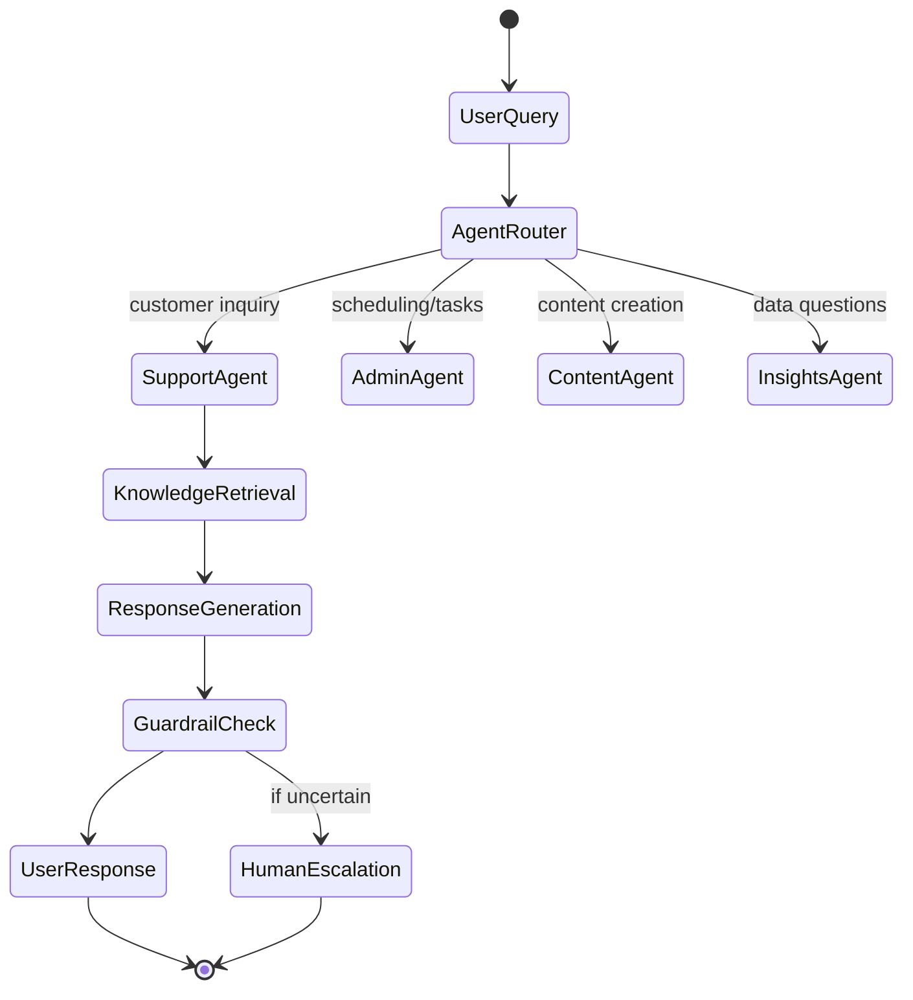
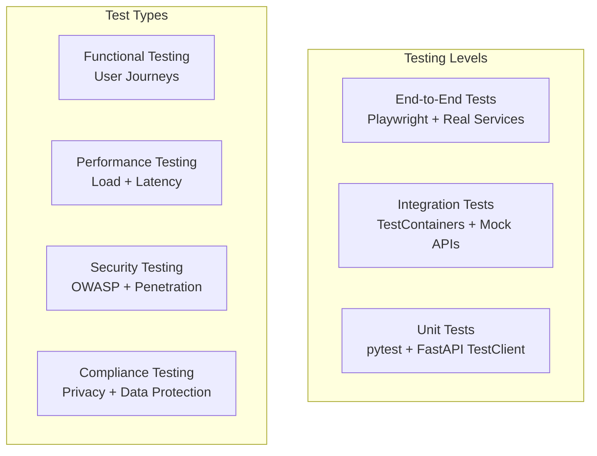

# ANZx.ai Platform Design Document

## Overview

ANZx.ai is a cloud-native, multi-agent AI platform built on Google Cloud Platform that provides small businesses with specialized AI assistants for support, administration, content creation, and business insights. The platform follows a microservices architecture with event-driven communication, leveraging GCP's native AI services and serverless technologies for scalability and cost-effectiveness.

The system is designed to handle the complete lifecycle from user onboarding through AI agent deployment, with robust security, compliance, and observability built-in. The architecture supports both local development and cloud deployment, with a focus on Australian market compliance while maintaining global scalability.

## Architecture

### High-Level Architecture



### Deployment Architecture

The platform uses a hybrid approach optimizing for both cost and performance:

- **Cloud Run** for API services (auto-scaling, pay-per-use)
- **GKE Autopilot** for agent orchestration (consistent workloads)
- **Cloud Functions** for event processing and webhooks
- **Cloud SQL** with read replicas for data persistence
- **Memorystore** for caching and session management

## Components and Interfaces

### 1. Core API Service

**Responsibility:** Central orchestration, user management, organization handling

**Technology Stack:**
- **Runtime:** Cloud Run with Python FastAPI
- **Database:** Cloud SQL PostgreSQL with connection pooling
- **Authentication:** Firebase Auth with custom claims
- **API Documentation:** OpenAPI 3.0 with automated generation

**Key Interfaces:**
```python
# User Management
POST /api/auth/magic-link
POST /api/auth/oauth/google
GET /api/me
POST /api/organizations

# Assistant Management  
POST /api/assistants
GET /api/assistants/{assistant_id}
PUT /api/assistants/{assistant_id}/config
DELETE /api/assistants/{assistant_id}

# Conversation Management
POST /api/conversations
GET /api/conversations/{conversation_id}/messages
POST /api/conversations/{conversation_id}/messages
```

### 2. Agent Orchestration Service (Vertex AI Agent Builder)

**Responsibility:** AI agent lifecycle, tool calling, multi-agent coordination

**Technology Stack (Aligned with agent-starter-pack):**
- **Primary:** Vertex AI Agent Builder for conversational AI agents
- **Function Calling:** Native tool integration with built-in connectors
- **Custom Workflows:** LangGraph for specialized Content/Insights workflows  
- **Model Access:** Gemini models via Vertex AI with Agent Builder integration
- **Tool Registry:** Centralized function declaration and execution system

**Agent Builder Integration (Following agent-starter-pack pattern):**
```python
class AgentSpaceManager:
    def __init__(self):
        # Initialize Vertex AI Agent Builder clients
        self.agent_builder_client = discoveryengine.ConversationalSearchServiceClient()
        self.tool_registry = ToolRegistry()
        
        # Register built-in tools following agent-starter-pack approach
        self._register_builtin_tools()
        
    async def create_agent_with_tools(self, agent_config: AgentConfig):
        # Create agent with function declarations
        tools = self._build_function_declarations(agent_config.enabled_tools)
        
        # Use Agent Builder for conversational agents
        if agent_config.type in ['support', 'admin']:
            return await self._create_agent_builder_agent(
                agent_config=agent_config,
                function_declarations=tools
            )
        # Custom LangGraph workflows for specialized agents  
        else:
            return await self._create_langgraph_agent(agent_config)

# Agent Space Configuration
agent_space_config = {
    "support_agent": {
        "connectors": ["gmail", "calendar", "knowledge_base"],
        "tools": ["email_response", "calendar_booking", "escalation"],
        "knowledge_sources": ["company_docs", "faq", "policies"]
    },
    "admin_agent": {
        "connectors": ["gmail", "calendar", "google_workspace"],
        "tools": ["schedule_meeting", "send_email", "create_task"],
        "integrations": ["google_workspace", "slack"]
    },
    "content_agent": {
        "connectors": ["custom_content_tools"],
        "tools": ["content_generation", "brand_analysis", "seo_optimization"],
        "custom_implementation": True  # Use custom LangGraph for specialized content workflows
    },
    "insights_agent": {
        "connectors": ["bigquery", "analytics"],
        "tools": ["data_query", "visualization", "trend_analysis"],
        "custom_implementation": True  # Use custom implementation for complex analytics
    }
}
```

**Multi-Agent Workflow:**


### 3. Knowledge Management Service

**Responsibility:** Document processing, embedding generation, RAG pipeline

**Technology Stack:**
- **Runtime:** Cloud Run with Python
- **Vector Database:** Cloud SQL PostgreSQL with pgvector extension
- **Embeddings:** Vertex AI Text Embeddings API (text-embedding-004)
- **Document Processing:** Cloud Document AI for OCR/parsing
- **Search:** Hybrid search combining semantic and keyword matching

**Processing Pipeline:**
```python
class KnowledgeProcessor:
    def process_document(self, source: DocumentSource) -> List[Chunk]:
        # 1. Extract text (PDF, DOCX, URL crawling)
        raw_text = self.extract_text(source)
        
        # 2. Chunk with overlap
        chunks = self.recursive_chunk(raw_text, size=1024, overlap=200)
        
        # 3. Generate embeddings
        embeddings = self.vertex_embeddings.embed_batch(chunks)
        
        # 4. Store with metadata
        return self.store_chunks(chunks, embeddings, source.metadata)
    
    def hybrid_search(self, query: str, filters: Dict) -> List[SearchResult]:
        # Combine semantic and keyword search
        semantic_results = self.vector_search(query, filters)
        keyword_results = self.fulltext_search(query, filters)
        return self.rerank_results(semantic_results + keyword_results)
```

### 4. Chat Widget Service

**Responsibility:** Embeddable widget, real-time communication, public API

**Technology Stack:**
- **Frontend:** Vanilla JavaScript (12KB bundle)
- **Backend:** Cloud Functions for webhook handling
- **Real-time:** WebSocket via Cloud Run with Socket.IO
- **CDN:** Cloud CDN for global widget distribution

**Widget Integration:**
```html
<script>
  window.anzxConfig = {
    assistantId: 'asst_xxx',
    theme: 'light',
    position: 'bottom-right'
  };
</script>
<script src="https://cdn.anzx.ai/widget/v1/anzx-widget.js"></script>
```

### 5. Integration Service (Future-Ready MCP Architecture)

**Responsibility:** Third-party API connections, OAuth flows, webhook handling, MCP server management

**Technology Stack:**
- **Runtime:** Cloud Functions for event-driven processing
- **OAuth:** Google OAuth 2.0 with secure token storage
- **Webhooks:** Cloud Functions with Pub/Sub for reliability
- **Rate Limiting:** Cloud Armor for API protection
- **MCP Support:** Model Context Protocol server management for future extensibility

**Simplified Integration Architecture with Agent Space:**
```python
class IntegrationManager:
    def __init__(self):
        self.agent_space_connectors = AgentSpaceConnectors()
        self.mcp_manager = MCPServerManager()
        self.direct_integrations = DirectIntegrationHandler()  # Fallback only
    
    async def execute_integration(self, integration_type: str, action: str, params: dict):
        # Priority: Agent Space connectors > MCP > Direct APIs
        if self.agent_space_connectors.supports(integration_type):
            return await self.agent_space_connectors.execute(integration_type, action, params)
        elif self.mcp_manager.has_server(integration_type):
            return await self.mcp_manager.execute(integration_type, action, params)
        else:
            return await self.direct_integrations.execute(integration_type, action, params)

class DirectIntegrationHandler:
    """Current direct API integrations for reliability"""
    def google_calendar_integration(self, user_token: str):
        scopes = ['https://www.googleapis.com/auth/calendar.events']
        
    def gmail_integration(self, user_token: str):
        scopes = ['https://www.googleapis.com/auth/gmail.modify']

class MCPServerManager:
    """Future-ready MCP server management"""
    def __init__(self):
        self.servers = {}
        self.server_configs = self.load_mcp_configs()
    
    async def register_mcp_server(self, server_name: str, config: MCPServerConfig):
        """Register new MCP servers as they become available"""
        self.servers[server_name] = await self.start_mcp_server(config)
    
    def has_server(self, integration_type: str) -> bool:
        return integration_type in self.servers
    
    async def execute(self, server_name: str, tool_name: str, params: dict):
        server = self.servers[server_name]
        return await server.call_tool(tool_name, params)
```

**MCP Integration Strategy (Built-in from Launch):**
- **Core Architecture:** Hybrid integration layer supporting both direct APIs and MCP servers from day one
- **Google Services:** Use googleapis/genai-toolbox MCP servers alongside direct API fallbacks
- **Third-party Services:** MCP-first approach for Stripe, Xero, and future integrations
- **Security:** Built-in MCP server validation, sandboxing, and compliance checking

**MCP Server Configuration (Launch Ready):**
```yaml
# mcp-servers.yaml - Production MCP server configuration
mcp_servers:
  google_gmail:
    enabled: true
    server: "googleapis/genai-toolbox"
    tools: ["gmail_send", "gmail_read", "gmail_search"]
    fallback: "direct_gmail_api"
    security_policy: "google_workspace"
    
  google_calendar:
    enabled: true
    server: "googleapis/genai-toolbox"
    tools: ["calendar_create_event", "calendar_list_events", "calendar_find_time"]
    fallback: "direct_calendar_api"
    security_policy: "google_workspace"
    
  stripe_billing:
    enabled: true
    server: "stripe-mcp-server"
    tools: ["create_subscription", "update_usage", "handle_webhook"]
    fallback: "direct_stripe_api"
    security_policy: "financial_services"
    
  xero_accounting:
    enabled: true
    server: "xero-mcp-server"
    tools: ["get_contacts", "get_invoices", "get_accounts"]
    fallback: "direct_xero_api"
    security_policy: "financial_services"
```

## Data Models

### Core Entities

```sql
-- Organizations and Users
CREATE TABLE organizations (
    id UUID PRIMARY KEY DEFAULT gen_random_uuid(),
    name VARCHAR(255) NOT NULL,
    region VARCHAR(10) DEFAULT 'AU',
    plan VARCHAR(50) DEFAULT 'freemium',
    settings JSONB DEFAULT '{}',
    created_at TIMESTAMP DEFAULT NOW(),
    updated_at TIMESTAMP DEFAULT NOW()
);

CREATE TABLE users (
    id UUID PRIMARY KEY DEFAULT gen_random_uuid(),
    organization_id UUID REFERENCES organizations(id),
    email VARCHAR(255) UNIQUE NOT NULL,
    role VARCHAR(50) DEFAULT 'owner',
    oauth_provider VARCHAR(50),
    oauth_subject VARCHAR(255),
    created_at TIMESTAMP DEFAULT NOW()
);

-- AI Assistants
CREATE TABLE assistants (
    id UUID PRIMARY KEY DEFAULT gen_random_uuid(),
    organization_id UUID REFERENCES organizations(id),
    type VARCHAR(50) NOT NULL, -- support, admin, content, insights
    name VARCHAR(255) NOT NULL,
    prompt_config JSONB DEFAULT '{}',
    tools_config JSONB DEFAULT '{}',
    is_active BOOLEAN DEFAULT true,
    created_at TIMESTAMP DEFAULT NOW(),
    updated_at TIMESTAMP DEFAULT NOW()
);

-- Knowledge Management
CREATE TABLE knowledge_sources (
    id UUID PRIMARY KEY DEFAULT gen_random_uuid(),
    organization_id UUID REFERENCES organizations(id),
    type VARCHAR(50) NOT NULL, -- file, url, faq
    name VARCHAR(255) NOT NULL,
    source_url TEXT,
    status VARCHAR(50) DEFAULT 'processing',
    metadata JSONB DEFAULT '{}',
    created_at TIMESTAMP DEFAULT NOW(),
    processed_at TIMESTAMP
);

CREATE TABLE documents (
    id UUID PRIMARY KEY DEFAULT gen_random_uuid(),
    source_id UUID REFERENCES knowledge_sources(id),
    chunk_id INTEGER NOT NULL,
    content TEXT NOT NULL,
    embedding vector(768), -- Vertex AI embedding dimension
    metadata JSONB DEFAULT '{}',
    created_at TIMESTAMP DEFAULT NOW()
);

-- Conversations and Messages
CREATE TABLE conversations (
    id UUID PRIMARY KEY DEFAULT gen_random_uuid(),
    organization_id UUID REFERENCES organizations(id),
    assistant_id UUID REFERENCES assistants(id),
    channel VARCHAR(50) NOT NULL, -- widget, email, api
    session_id VARCHAR(255),
    status VARCHAR(50) DEFAULT 'active',
    metadata JSONB DEFAULT '{}',
    started_at TIMESTAMP DEFAULT NOW(),
    ended_at TIMESTAMP
);

CREATE TABLE messages (
    id UUID PRIMARY KEY DEFAULT gen_random_uuid(),
    conversation_id UUID REFERENCES conversations(id),
    role VARCHAR(50) NOT NULL, -- user, assistant, system
    content TEXT NOT NULL,
    tokens INTEGER DEFAULT 0,
    latency_ms INTEGER DEFAULT 0,
    cost_usd DECIMAL(10,6) DEFAULT 0,
    metadata JSONB DEFAULT '{}',
    created_at TIMESTAMP DEFAULT NOW()
);

-- Billing and Usage
CREATE TABLE subscriptions (
    organization_id UUID PRIMARY KEY REFERENCES organizations(id),
    stripe_customer_id VARCHAR(255) NOT NULL,
    stripe_subscription_id VARCHAR(255),
    plan VARCHAR(50) NOT NULL,
    status VARCHAR(50) DEFAULT 'active',
    usage_counters JSONB DEFAULT '{}',
    current_period_start TIMESTAMP,
    current_period_end TIMESTAMP,
    created_at TIMESTAMP DEFAULT NOW()
);

-- Events and Audit
CREATE TABLE events (
    id UUID PRIMARY KEY DEFAULT gen_random_uuid(),
    organization_id UUID REFERENCES organizations(id),
    type VARCHAR(100) NOT NULL,
    payload JSONB NOT NULL,
    created_at TIMESTAMP DEFAULT NOW()
);
```

### Vector Search Optimization

```sql
-- Indexes for performance
CREATE INDEX idx_documents_embedding ON documents USING ivfflat (embedding vector_cosine_ops);
CREATE INDEX idx_documents_source_id ON documents(source_id);
CREATE INDEX idx_documents_metadata ON documents USING gin(metadata);
CREATE INDEX idx_conversations_org_assistant ON conversations(organization_id, assistant_id);
CREATE INDEX idx_messages_conversation_created ON messages(conversation_id, created_at);
```

## Error Handling

### Error Classification and Response Strategy

```python
class ANZxError(Exception):
    """Base exception class with structured error handling"""
    
class ValidationError(ANZxError):
    """Client input validation errors - 400 responses"""
    
class AuthenticationError(ANZxError):
    """Authentication failures - 401 responses"""
    
class AuthorizationError(ANZxError):
    """Permission denied - 403 responses"""
    
class ResourceNotFoundError(ANZxError):
    """Resource not found - 404 responses"""
    
class RateLimitError(ANZxError):
    """Rate limiting - 429 responses"""
    
class ExternalServiceError(ANZxError):
    """Third-party service failures - 502/503 responses"""
    
class InternalError(ANZxError):
    """System errors - 500 responses"""
```

### Retry and Circuit Breaker Patterns

```python
class AIServiceClient:
    def __init__(self):
        self.circuit_breaker = CircuitBreaker(
            failure_threshold=5,
            recovery_timeout=30,
            expected_exception=ExternalServiceError
        )
    
    @retry(
        stop=stop_after_attempt(3),
        wait=wait_exponential(multiplier=1, min=4, max=10),
        retry=retry_if_exception_type(ExternalServiceError)
    )
    async def generate_response(self, prompt: str) -> str:
        with self.circuit_breaker:
            return await self.vertex_ai_client.generate(prompt)
```

### Graceful Degradation

- **AI Service Unavailable:** Fall back to cached responses or human handoff
- **Knowledge Search Failure:** Return generic responses with escalation options
- **Integration Failures:** Queue operations for retry with user notification
- **Database Issues:** Use read replicas and cached data where possible

## Testing Strategy

### Testing Pyramid



### Test Implementation Strategy

**Unit Tests (70% coverage target):**
```python
# Core business logic testing
def test_agent_response_generation():
    agent = SupportAgent(knowledge_base=mock_kb)
    response = agent.generate_response("How do I reset my password?")
    assert response.confidence > 0.8
    assert "password reset" in response.content.lower()

# Data model validation
def test_organization_creation():
    org = Organization(name="Test Corp", region="AU")
    assert org.is_valid()
    assert org.compliance_settings["privacy_framework"] == "APP"
```

**Integration Tests (API + Database):**
```python
@pytest.mark.integration
def test_knowledge_upload_pipeline():
    # Test complete document processing pipeline
    with TestClient(app) as client:
        response = client.post("/api/knowledge/upload", 
                             files={"file": test_pdf})
        assert response.status_code == 202
        
        # Verify processing completion
        job_id = response.json()["job_id"]
        assert wait_for_processing(job_id, timeout=30)
```

**End-to-End Tests (User Journeys):**
```python
@pytest.mark.e2e
def test_complete_support_flow():
    # Test full user journey from widget to resolution
    page.goto("https://test-business.com")
    page.click("[data-anzx-widget]")
    page.fill("[data-testid=chat-input]", "I need help with billing")
    
    # Verify AI response
    response = page.wait_for_selector("[data-testid=ai-response]")
    assert "billing" in response.text_content().lower()
```

### Performance Testing

**Load Testing with Artillery:**
```yaml
config:
  target: 'https://api.anzx.ai'
  phases:
    - duration: 300
      arrivalRate: 10
      name: "Warm up"
    - duration: 600  
      arrivalRate: 50
      name: "Sustained load"

scenarios:
  - name: "Chat interaction"
    weight: 70
    flow:
      - post:
          url: "/api/chat"
          json:
            assistant_id: "{{ assistantId }}"
            message: "{{ randomMessage }}"
```

**Performance Targets:**
- **API Response Time:** p95 < 200ms for cached, < 2.5s for AI generation
- **Widget Load Time:** < 100ms first paint, < 12KB bundle size
- **Concurrent Users:** 1000+ simultaneous chat sessions
- **Throughput:** 10,000+ API requests per minute

### Security Testing

**Automated Security Scanning:**
- **SAST:** SonarQube integration in CI/CD pipeline
- **DAST:** OWASP ZAP automated scanning
- **Dependency Scanning:** Snyk for vulnerability detection
- **Container Scanning:** Google Container Analysis

**Manual Security Testing:**
- **Penetration Testing:** Quarterly third-party assessments
- **Privacy Impact Assessment:** Annual compliance review
- **OAuth Flow Testing:** Integration security validation

### Compliance Testing

**Australian Privacy Principles (APP) Validation:**
```python
def test_app_compliance():
    # APP 1: Open and transparent management
    assert privacy_policy_accessible()
    
    # APP 5: Notification of collection
    assert consent_flow_implemented()
    
    # APP 12: Access to personal information
    assert user_data_export_available()
    
    # APP 13: Correction of personal information
    assert user_data_correction_available()
```

## Future-Readiness and MCP Integration Strategy

### MCP Ecosystem Preparation

The platform is designed with a **hybrid integration approach** that ensures immediate functionality while preparing for the MCP ecosystem's growth:

**Current State (Direct Integrations):**
- Reliable, well-tested APIs for core functionality
- Full control over error handling and rate limiting
- Optimized for performance and cost

**Future State (MCP-Ready):**
- **Tool Registry Architecture:** Allows seamless addition of MCP tools alongside direct integrations
- **Fallback Strategy:** MCP tools can fallback to direct integrations for reliability
- **Gradual Migration:** Move integrations to MCP as they mature and prove stable
- **Extensibility:** Easy addition of new MCP servers without architectural changes

**MCP Integration Benefits:**
- **Rapid Integration:** Add new services as MCP servers become available
- **Standardized Interface:** Consistent tool calling across different services
- **Community Ecosystem:** Leverage community-built MCP servers
- **Reduced Maintenance:** Less custom integration code to maintain

**Implementation Approach:**
1. **MVP Launch:** Full MCP support with googleapis/genai-toolbox for Google services
2. **Core Integrations:** MCP servers for Stripe billing and Xero accounting
3. **Extensibility:** Plugin architecture for community and custom MCP servers
4. **Fallback Strategy:** Direct API implementations as backup for critical services

This approach ensures **immediate market readiness** while positioning ANZx.ai to capitalize on the growing MCP ecosystem, making it truly future-ready for the evolving AI integration landscape.

### Competitive Advantage

By building MCP-ready architecture now, ANZx.ai will be positioned to:
- **Rapidly add new integrations** as MCP servers become available
- **Offer more integrations than competitors** who rely solely on direct APIs
- **Reduce development costs** for new integrations over time
- **Attract developers** who want to extend the platform via MCP

This comprehensive design provides a solid foundation for building the ANZx.ai platform with enterprise-grade reliability, security, and scalability while leveraging Google Cloud's native services for cost optimization and performance, all while being future-ready for the MCP ecosystem evolution.