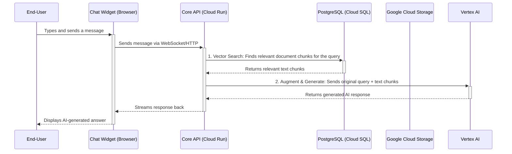

# ANZx.ai Platform

Advanced AI assistants, freeing up human entrepreneurs to focus on strategic work.

## Platform Overview

At its core, the ANZx.ai platform is a sophisticated, multi-tenant Software-as-a-Service (SaaS) solution designed to empower businesses ("customers") to build and deploy their own advanced AI virtual agents. These agents are then made available to the business's own users ("end-customers") through an embeddable chat widget.

The architecture is built on a modern microservices stack, leveraging Python/FastAPI for the backend, a lightweight JavaScript for the frontend chat widget, and Google's Vertex AI for the intelligence layer. The entire system is designed for cloud-native deployment, particularly on Google Cloud Platform.

### How the ANZx.ai Platform Works

The platform facilitates a seamless flow of information from a business's private data to an end-user's chat query.

1.  **Onboarding & Setup**: A business (your customer) signs up and logs into the platform via the `auth-frontend`.
2.  **Knowledge Ingestion**: The customer uploads their business documents or provides website URLs through a dashboard (powered by your `core-api`). The Knowledge Management System kicks in:
    *   It extracts text from these sources.
    *   It breaks the text into smaller, meaningful chunks.
    *   It converts these chunks into numerical representations (vector embeddings) via the Vertex AI Embeddings API.
    *   These embeddings are stored in the database, creating a searchable "brain" for that specific customer.
3.  **Agent Configuration**: The customer configures their AI agent, defining its purpose and linking it to the newly created knowledge base.
4.  **End-User Interaction**: An end-user visits the customer's website and asks a question in the `chat-widget`.
5.  **Retrieval-Augmented Generation (RAG) in Action**:
    *   The `chat-widget` sends the question to the `core-api`.
    *   The API performs a semantic search over the vector database to find the most relevant text chunks from the customer's documents that relate to the end-user's question. This is the **Retrieval** step.
    *   The API then sends the original question along with the retrieved text chunks as context to the Google Vertex AI agent.
    *   The agent uses this context to formulate a relevant, accurate, and natural-sounding answer. This is the **Generation** step.
    *   The final answer, often with citations pointing to the source documents, is sent back to the chat widget and displayed to the end-user.

### How Your Customers Will Use It

Your customers (businesses, entrepreneurs) will experience the platform as a powerful tool to automate customer support and engagement.

1.  **Login**: They will start by signing into their account through the `auth-frontend`.
2.  **Create a Knowledge Base**: They will upload their internal documentation, FAQs, product catalogs, and policy documents. This is a "train once, use forever" model where they provide the raw knowledge.
3.  **Deploy the Agent**: They will copy a simple JavaScript snippet for the chat widget and paste it into their website's HTML.
4.  **Monitor & Manage**: Through a future dashboard, they would be able to view conversation histories, analyze the types of questions being asked, and monitor usage for billing purposes.

### How End-Customers Will Benefit and Use It

The end-customers (visitors to your customers' websites) will receive the most direct benefit:

1.  **Instant Support**: They can ask questions and get immediate, 24/7 answers directly on the website, without waiting for a human agent.
2.  **Accurate Information**: Because the AI's answers are grounded in the company's own documents, the information is trustworthy and specific to that business. For example, they can ask "What is your return policy for items bought on sale?" and get a precise answer, not a generic one.
3.  **Natural Conversation**: They will interact with the chat widget just like they would with a human, using natural language. They can ask follow-up questions and have a coherent conversation.

In essence, you have built a robust platform that allows any business to create a powerful, knowledgeable AI assistant, dramatically improving their customer service capabilities and freeing up their human team to focus on more strategic work.

## Architecture

The ANZx.ai platform is built as a cloud-native microservices architecture with the following components.

### Services

- **Core API** (`services/core-api/`) - FastAPI service handling authentication, billing, and core business logic.
- **Agent Orchestration** (`services/agent-orchestration/`) - AI agent management and conversation routing.
- **Knowledge Service** (`services/knowledge-service/`) - Document processing, embeddings, and RAG system.
- **Chat Widget** (`services/chat-widget/`) - Embeddable JavaScript widget for customer interactions.
- **Auth Frontend** (`services/auth-frontend/`) - Customer-facing login portal.

### Service Responsibilities

Each microservice has a distinct role in the platform's operation:

-   **`auth-frontend`**: A lightweight React application that provides the customer-facing login portal. It integrates with Firebase Authentication to handle Google sign-ins and exchanges the Firebase token for a platform-specific JWT from the Core API.

-   **`core-api`**: The central nervous system of the platform. Its responsibilities include:
    -   **Authentication & Authorization**: Validating JWTs and securing endpoints.
    -   **Business Logic**: Managing organizations, users, billing, and subscriptions.
    -   **Knowledge Pipeline**: Handling document uploads (to Cloud Storage), orchestrating text extraction, chunking, and triggering embedding generation via Vertex AI.
    -   **RAG Execution**: Receiving queries from the chat widget, performing vector searches against the PostgreSQL database, and calling the Vertex AI agent with the retrieved context.
    -   **API Gateway**: Serving as the primary endpoint for both the `auth-frontend` and the `chat-widget`.

-   **`chat-widget`**: A vanilla JavaScript application designed for maximum compatibility and performance. It gets embedded on the customer's website. Its job is to capture end-user messages, display the conversation history, and communicate with the `core-api` in real-time using WebSockets (with an HTTP fallback).

-   **`agent-orchestration` & `knowledge-service`**: In the current architecture, the core logic for these functions resides within the `core-api` to simplify deployment. Their names reflect the logical separation of concerns, with future potential to be spun out into their own dedicated services as the platform scales.

### Infrastructure

- **PostgreSQL with pgvector** - Primary database with vector embeddings support.
- **Redis** - Caching and message queuing.
- **Docker & Docker Compose** - Containerized development and deployment.

## End-to-End Application Flow

This diagram illustrates the sequence of events when an end-user asks a question.



## GCP Infrastructure Overview

The platform is designed to run efficiently on a scalable, serverless Google Cloud infrastructure.

```mermaid
graph TD
    subgraph "User Interaction"
        User[End-User / Customer]
    end

    subgraph "Google Cloud Platform"
        LB[Cloud Load Balancer]

        subgraph "Frontend Services (Cloud Run)"
            Auth[auth-frontend]
            WidgetDemo[chat-widget-demo]
        end

        subgraph "Backend Services (Cloud Run)"
            CoreAPI[core-api]
        end

        subgraph "Data & Storage"
            DB[(Cloud SQL for PostgreSQL<br>with pgvector)]
            GCS[(Cloud Storage<br>for documents)]
            Redis[(Memorystore for Redis<br>for caching)]
        end

        subgraph "AI & Intelligence"
            Vertex[Vertex AI<br>(Embeddings & Agent Builder)]
        end

        subgraph "CI/CD & Operations"
            Build[Cloud Build]
            Registry[Artifact Registry]
            Logging[Cloud Logging]
        end
    end

    User --> LB
    LB --> Auth
    LB --> WidgetDemo
    LB --> CoreAPI

    CoreAPI --> DB
    CoreAPI --> GCS
    CoreAPI --> Redis
    CoreAPI --> Vertex

    Build --> Registry
    Registry --> CoreAPI
    Registry --> Auth
    Registry --> WidgetDemo
```

## How ANZx.ai Works for Your Business

The ANZx.ai platform empowers you to create a sophisticated AI assistant trained on your own business data. This assistant can be seamlessly integrated into your website to provide instant, accurate support to your customers, 24/7.

### Use Cases & Benefits by Industry

The flexibility of the ANZx.ai platform allows it to be adapted for a wide range of industries. Here’s how different businesses can leverage the platform:

#### 1. E-commerce & Retail

An online store can use the platform to build an AI shopping assistant that dramatically improves the customer experience and boosts sales.

*   **How they use it:** Upload product catalogs, shipping policies, return procedures, and FAQs into the ANZx.ai knowledge base.
*   **End-customer benefits:**
    *   **Instant Product Expertise:** "Does the blue jacket come in an XL size?" or "Is this laptop compatible with my design software?"
    *   **Order & Return Queries:** "Where is my order #12345?" or "How do I start a return for a damaged item?"
    *   **Personalized Recommendations:** "What are your best-selling running shoes for women?"

#### 2. SaaS (Software as a Service)

A SaaS company can deploy an AI support agent to handle technical queries, guide users through features, and provide instant onboarding assistance.

*   **How they use it:** Upload technical documentation, API guides, user manuals, and troubleshooting articles.

*   **End-customer benefits:**
    *   **On-demand Technical Support:** "How do I integrate your API with my application?" or "I'm getting a 'Permission Denied' error, how do I fix it?"
    *   **Feature Discovery:** "Can you show me how to create a new project dashboard?"
    *   **24/7 Onboarding:** New users can get immediate help without waiting for a support ticket to be resolved.

#### 3. Real Estate

A real estate agency can create a virtual property assistant to engage potential buyers and renters around the clock.

*   **How they use it:** Upload property listings with detailed descriptions, virtual tour links, information about neighborhoods, and guides on the buying/renting process.

*   **End-customer benefits:**
    *   **Detailed Property Inquiries:** "Does the property at 123 Main St have a backyard?" or "What are the school ratings in this area?"
    *   **Appointment Scheduling:** "Can I schedule a viewing for this Saturday?"
    *   **Financing & Process Questions:** "What are the typical closing costs?" or "What documents do I need to apply for a rental?"

#### 4. Education & Training

An educational institution or online course provider can build an AI student advisor to assist with admissions, course details, and campus information.

*   **How they use it:** Upload course catalogs, admission requirements, campus maps, and student handbooks.

*   **End-customer benefits:**
    *   **Admissions Help:** "What are the application deadlines for the computer science program?" or "Do you accept international students?"
    *   **Course Information:** "What are the prerequisites for the 'Advanced AI' course?"
    *   **Campus Navigation:** "Where is the library located on campus?"

### Customer Success Stories: Real-World Impact

Here’s how real business owners are using ANZx.ai to solve critical problems, save time, and grow their revenue.

#### Persona 1: Sarah, the E-commerce Entrepreneur

*   **Business:** A growing online Shopify store selling handmade leather goods.
*   **Problem:** Sarah is overwhelmed by the constant stream of repetitive customer questions about product materials, order tracking, and return policies. She's losing potential sales because she can't respond instantly, and she can't afford a 24/7 human support team.

*   **Onboarding & Implementation (Under 30 minutes):**
    1.  Sarah signs up for ANZx.ai after searching for "AI customer support for Shopify".
    2.  She spends 20 minutes uploading her product catalog (CSV file), the URL to her FAQ page, and her shipping policy PDF.
    3.  She copies the one-line JavaScript snippet and pastes it into her Shopify website's theme.

*   **Solution & Quantifiable Impact:**
    *   **AI Workforce Activated:** Her website now has an "AI Sales Assistant" working 24/7. It handles approximately 80% of all incoming customer queries.
    *   **Time Saved:** Sarah previously spent 3-4 hours per day answering customer emails and chats. She now invests in product design and marketing.
    *   **Revenue Growth:** The AI assistant helps customers with product choices and instantly answers questions that were previously barriers to purchase. This leads to a **6% increase in conversion rate** among visitors who engage with the chat widget, resulting in thousands of dollars in new monthly revenue.

#### Persona 2: David, the SaaS Founder

*   **Business:** A B2B SaaS platform providing project management tools.
*   **Problem:** David's small support team is bogged down with basic "how-to" questions from free-tier users. This prevents them from providing the high-touch support his enterprise clients need, and he's seeing an increase in churn due to slow response times.

*   **Onboarding & Implementation (Under 2 hours):**
    1.  David hears about ANZx.ai in a founder community and decides to try it.
    2.  He has his team upload their entire technical documentation library, API guides, and knowledge base articles.
    3.  The AI is trained on this data, and the chat widget is embedded within their app and on their public documentation site.

*   **Solution & Quantifiable Impact:**
    *   **AI Workforce Activated:** The platform now has an "AI Support Engineer" that acts as the first line of defense for all support queries.
    *   **Operational Efficiency:** The AI successfully deflects over 60% of Level 1 support tickets. This frees up a collective **40 hours per week** for his human support team. They now focus on proactive outreach to enterprise customers, reducing churn by **10%**.
    *   **Improved Customer Satisfaction:** The average response time for basic technical questions drops from over 8 hours to instantaneous. The company's Customer Satisfaction (CSAT) score improves by **18 points** within two months.

## Quick Start

### Prerequisites

- Docker and Docker Compose
- Make (optional, for convenience commands)

### Development Setup

1. **Clone and start the platform:**
   ```bash
   git clone <repository-url>
   cd anzx-ai-virtual-agents
   make quick-start
   ```

2. **Or manually with Docker Compose:**
   ```bash
   docker-compose build
   docker-compose up -d
   ```

3. **Access the services:**
   - Core API: http://localhost:8000
   - Agent Orchestration: http://localhost:8001
   - Knowledge Service: http://localhost:8002
   - Chat Widget: http://localhost:8003

4. **Development tools (optional):**
   ```bash
   make up-dev
   ```
   - PgAdmin: http://localhost:5050 (admin@anzx.ai / admin)
   - Redis Commander: http://localhost:8081

### Available Commands

```bash
make help           # Show all available commands
make build          # Build all containers
make up             # Start all services
make up-dev         # Start with development tools
make down           # Stop all services
make logs           # View logs from all services
make test           # Run all tests
make clean          # Clean up containers and volumes
```

## Development

### Project Structure

```
anzx-ai-virtual-agents/
├── services/
│   ├── core-api/           # FastAPI core service
│   ├── agent-orchestration/   # AI agent management
│   ├── knowledge-service/     # Document processing & RAG
│   └── chat-widget/          # Embeddable chat widget
├── scripts/                # Database and deployment scripts
├── .kiro/                  # Kiro IDE specifications
├── docker-compose.yml      # Local development environment
└── Makefile               # Development commands
```

### Adding New Features

1. Review the feature specifications in `.kiro/specs/anzx-ai-platform/`
2. Follow the implementation tasks outlined in `tasks.md`
3. Implement changes in the appropriate service
4. Add tests and update documentation
5. Test locally with `make test`

### Database Migrations

```bash
# Run migrations
make db-migrate

# Reset database (development only)
make db-reset
```

## Production Deployment

The platform is designed for deployment on Google Cloud Platform using:

- **Cloud Run** - Containerized service deployment
- **Cloud SQL** - Managed PostgreSQL with pgvector
- **Cloud Storage** - Document and asset storage
- **Cloud Build** - CI/CD pipeline
- **Cloud Monitoring** - Observability and alerting

See the infrastructure specifications in `.kiro/specs/anzx-ai-platform/design.md` for detailed deployment architecture.

## Contributing

1. Follow the development workflow outlined in the specifications
2. Ensure all tests pass before submitting changes
3. Follow the coding standards and linting rules
4. Update documentation for any new features

## License

MIT License - see LICENSE file for details.

---
## System Architecture and Live Status Analysis

This section provides a comprehensive analysis of the ANZX.ai Platform project, based on a review of the codebase, infrastructure-as-code, and live GCP deployment status as of September 21, 2025.

### Service Configurations & Connections

1.  **Chat Widget (`chat-widget`):**
    *   **Role:** The user-facing interface. It's a vanilla JavaScript application that can be embedded on any website.
    *   **Connection:** It initiates a WebSocket connection to the Core API (`/api/chat-widget/ws/{widget_id}`) for real-time communication. If WebSockets fail, it falls back to standard HTTP polling to the same API (`/api/chat-widget/public/chat`). All communication is with the Core API.

2.  **Core API (`core-api`):**
    *   **Role:** The central nervous system. It manages authentication, user data, billing, and acts as a secure gateway to the other backend services. It is the only service the user's browser directly communicates with.
    *   **Connections:**
        *   **Receives requests from:** The Chat Widget.
        *   **Cloud SQL (Postgres):** Connects to the database to manage user, organization, and assistant data.
        *   **Redis:** Used for caching sessions and other ephemeral data.
        *   **Agent Orchestration:** When a chat message requires an AI-powered response, the Core API forwards the request to the appropriate endpoint on the Agent Orchestration service (e.g., `/orchestrate/support`).

3.  **Knowledge Service (`knowledge-service`):**
    *   **Role:** The RAG (Retrieval-Augmented Generation) engine. It does not receive requests directly from the user or Core API during a chat. Its primary role is asynchronous document processing.
    *   **Connections & AI Usage:**
        *   **Receives requests from:** An administrator or system process that uses its `/documents` endpoint to upload files.
        *   **Cloud Storage:** Stores the original uploaded documents (PDFs, etc.) for archival.
        *   **`sentence-transformers`:** Uses the `all-MiniLM-L6-v2` model to convert chunks of text into 384-dimension vector embeddings.
        *   **Cloud SQL (Postgres w/ `pgvector`):** Stores the text chunks and their corresponding vector embeddings in the `document_chunks` table.
        *   **Provides data to:** The Agent Orchestration service via its `/search` endpoint.

4.  **Agent Orchestration (`agent-orchestration`):**
    *   **Role:** The "brain" that constructs AI responses. It executes a logical sequence of steps to answer a user's query.
    *   **Connections & AI Usage:**
        *   **Receives requests from:** The Core API.
        *   **Knowledge Service:** It makes an HTTP POST request to the Knowledge Service's `/search` endpoint, sending the user's query. The Knowledge Service performs a vector similarity search and returns the most relevant text chunks as "context".
        *   **Vertex AI (`langchain_google_vertexai`):** After retrieving context, it constructs a detailed prompt containing both the original question and the retrieved context. It then sends this prompt to a Google Gemini model (`gemini-1.5-pro`) via the Vertex AI API to generate a final, context-aware answer.
        *   **LangGraph:** This framework defines the sequence of operations: `retrieve_context` -> `generate_response` -> `END`.

### End-to-End Flow Diagram

Here is a Mermaid diagram illustrating the complete request and data flow for a typical user query.

```mermaid
graph TD
    subgraph "User's Browser"
        A[Chat Widget]
    end

    subgraph "GCP Cloud Run Services"
        B[Core API]
        C[Agent Orchestration]
        D[Knowledge Service]
    end

    subgraph "GCP Data & AI Services"
        E[Cloud SQL (Postgres w/ pgvector)]
        F[Redis]
        G[Vertex AI (Gemini 1.5 Pro)]
        H[Cloud Storage]
    end

    subgraph "External Services"
        I[Stripe API]
    end

    %% User Interaction Flow
    A -- "1. Send Message (WebSocket/HTTP)" --> B;

    %% Core API Logic
    B -- "2. Auth & Get User Data" --> E;
    B -- "3. Cache Session" --> F;
    B -- "4. Forward to Agent" --> C;
    B -- "Manages Billing" --> I;

    %% Agent Orchestration Logic
    C -- "5. Retrieve Context" --> D;
    D -- "6. Vector Search in DB" --> E;
    D -- "7. Return Relevant Chunks" --> C;
    C -- "8. Generate Answer (Prompt + Context)" --> G;
    G -- "9. Return Generated Text" --> C;
    C -- "10. Return Final Answer" --> B;

    %% Final Response to User
    B -- "11. Send Response to Widget" --> A;

    %% Asynchronous Knowledge Ingestion Flow
    subgraph "Admin/System"
        J[Upload Document via API]
    end
    J -- "a. Upload PDF/TXT" --> D;
    D -- "b. Store Original in GCS" --> H;
    D -- "c. Create Embeddings & Store in DB" --> E;

    %% Styling
    classDef user fill:#cde4ff,stroke:#4a86e8;
    classDef gcp_run fill:#d4edda,stroke:#155724;
    classDef gcp_data fill:#f8d7da,stroke:#721c24;
    classDef external fill:#fff3cd,stroke:#856404;
    classDef admin fill:#e8dff5,stroke:#674ea7;

    class A user;
    class B,C,D gcp_run;
    class E,F,G,H gcp_data;
    class I external;
    class J admin;
